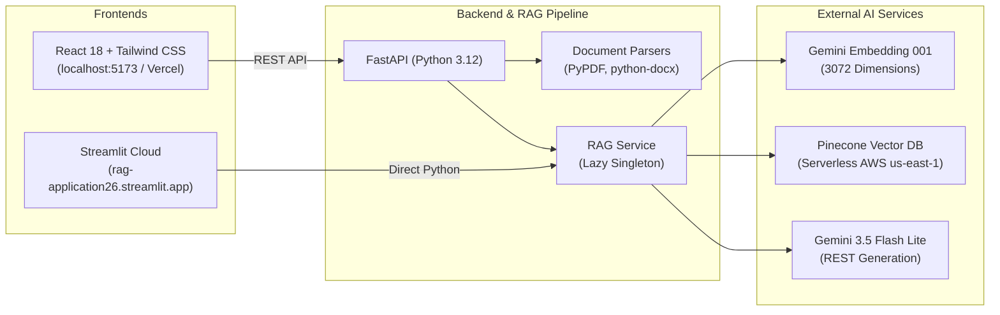

# DocChat — RAG Document Q&A 🧠📄

[](https://rag-application26.streamlit.app)
[](https://fastapi.tiangolo.com)
[](https://react.dev/)
[](https://ai.google.dev/)
[-000000.svg?logo=pinecone&logoColor=white)](https://www.pinecone.io/)

A production-ready **Retrieval-Augmented Generation (RAG)** system allowing users to upload documents (PDF, DOCX, TXT, MD) and hold intelligent, context-grounded conversations with transparent source citations.

---

## 🌐 Live Demos & Access

| Platform | Link | Description |
| :--- | :--- | :--- |
| ☁️ **Streamlit Cloud** | [**rag-application26.streamlit.app**](https://rag-application26.streamlit.app) | **24/7 Live Public Web App** (Zero installation required) |
| 💻 **Localhost (Full-Stack)** | [**http://localhost:5173**](http://localhost:5173) | **React + Tailwind UI** running on local FastAPI backend (`:8082`) |

---

## ✨ Features

- 📑 **Multi-Format Parsing**: Ingest `.pdf`, `.docx`, `.txt`, and `.md` files seamlessly.
- ⚡ **Ultra-Fast Generation**: Powered by **Google Gemini 3.5 Flash Lite** via high-throughput REST transport (~2s latency).
- 🌲 **High-Dimensional Vector Search**: **Pinecone Serverless** vector database indexing with **3072-dimensional** embeddings (`models/gemini-embedding-001`).
- 🎯 **Verifiable Source Citations**: Every generated answer references the exact source document, page number, and text chunk.
- 💬 **Multi-Turn Conversation Memory**: Retains conversational context across multi-turn interactions.
- 🛡️ **Non-Blocking Architecture**: Blocking vector and model I/O offloaded to worker threadpools (`anyio`) to keep the async event loop responsive.
- 🚀 **Dual Frontends**: Choose between a full-stack **React + Tailwind** web application or a single-click **Streamlit Cloud** interface.

---

## 🛠️ Tech Stack



---

## 🚀 Quickstart Guide

### Option 1: 1-Click Launch (Windows Localhost)

If you're on Windows, simply double-click the included batch launcher:
```bash
run_local.bat
```
This automatically starts both the FastAPI backend (`:8082`) and the React Vite frontend (`:5173`), and opens your browser.

---

### Option 2: Manual Localhost Setup

#### 1. Backend Setup (FastAPI)
```bash
cd backend
python -m venv .venv

# Activate virtual environment
# Windows:
.venv\Scripts\activate
# Mac/Linux:
source .venv/bin/activate

# Install dependencies
pip install -r requirements.txt
```

Create a `.env` file inside the `backend/` folder:
```env
GEMINI_API_KEY=your_gemini_api_key
PINECONE_API_KEY=your_pinecone_api_key
PINECONE_ENV=us-east-1
PINECONE_INDEX=rag-qa-index
```

Start the backend:
```bash
uvicorn main:app --reload --port 8082
```
*API reference available at [http://localhost:8082/docs](http://localhost:8082/docs).*

#### 2. Frontend Setup (React Vite)
In a new terminal:
```bash
cd frontend
npm install
npm run dev
```
Open **[http://localhost:5173](http://localhost:5173)** in your browser.

---

### Option 3: Run Streamlit Locally

```bash
streamlit run streamlit_app.py
```
Open **[http://localhost:8501](http://localhost:8501)** in your browser.

---

## ☁️ Cloud Deployment

### 1. Streamlit Community Cloud (1-Click Deployment)
1. Go to [share.streamlit.io](https://share.streamlit.io/) and connect your GitHub repo.
2. Set **Main file path**: `streamlit_app.py`.
3. In **Advanced Settings -> Secrets**, add:
   ```toml
   GEMINI_API_KEY = "your_gemini_key"
   PINECONE_API_KEY = "your_pinecone_key"
   PINECONE_ENV = "us-east-1"
   PINECONE_INDEX = "rag-qa-index"
   ```
4. Click **Deploy**! Live at: `https://rag-application26.streamlit.app`.

### 2. Vercel (Frontend) + Render (Backend)
- **Backend on Render.com**:
  - New Web Service -> Root Directory: `backend`
  - Build Command: `pip install -r requirements.txt`
  - Start Command: `uvicorn main:app --host 0.0.0.0 --port $PORT`
  - Add Environment Variables from `.env`.
- **Frontend on Vercel**:
  - Import repo -> Set **Root Directory**: `frontend`.
  - Add Environment Variable: `VITE_API_URL` pointing to your Render backend URL.

---

## 📡 API Endpoints (FastAPI)

| Method | Endpoint | Description |
| :--- | :--- | :--- |
| `GET` | `/health/` | Service health status check |
| `POST` | `/api/documents/upload` | Upload & index file (`multipart/form-data`) |
| `GET` | `/api/documents/` | List all indexed documents in memory |
| `DELETE` | `/api/documents/{id}` | Delete document and vector embeddings from Pinecone |
| `POST` | `/api/query/` | Ask questions with optional doc filters and chat history |

---

## 🧪 Testing

Run automated backend test suite:
```bash
cd backend
pytest tests/ -v
```

All 5 core tests verify:
- Health check endpoint
- File validation & upload indexing
- Unsupported format rejection
- RAG question querying & response schema
- Empty question validation

---

## 📄 License
MIT License. Free to use and customize for personal and commercial projects.
